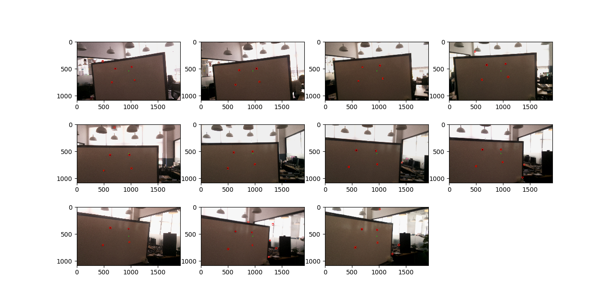
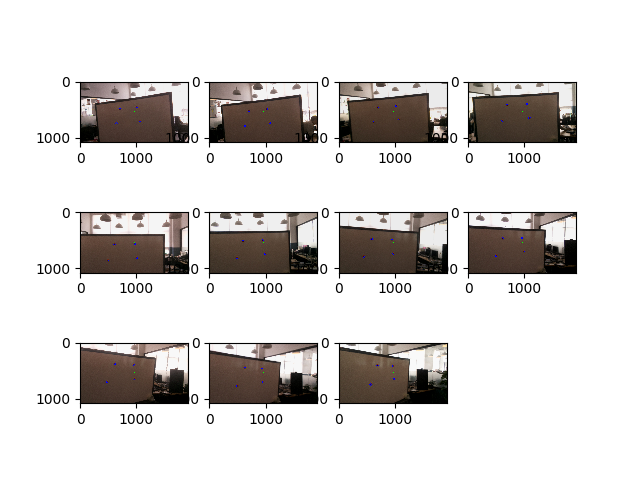
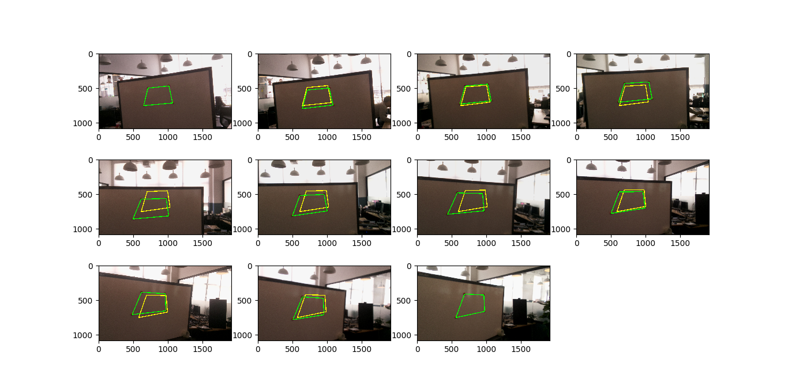

# Image sequence stabilization for bullet time effect

### Install:

- sudo apt-get install python-pip python-dev 
- sudo apt-get install python-tk
- sudo pip install -r requirements.txt 

### demo:

Set and adjust the parameters to find the desired points. Set the calibrated parameter to 0.
```sh
Algo$ python adjust_points.py --dataDir ./samples/images/ --param1 10 --param2 20 --minRadius 10 --maxRadius 19 --thresDistCent 600 --ux 1200 --ly 360 --calibrated 0
```
The above parameters setting is the desired one. Try change some parameter with any value, for example the following below:
```sh
Algo$ python adjust_points.py --dataDir ./samples/images/ --param1 10 --param2 20 --minRadius 10 --maxRadius 19 --thresDistCent 600 --calibrated 0
```
The above command use ux and ly default parameters, and you see there are some undesired points in some images in the following figure:


Set the calibrated parameter to 1 if the parameters has correctly been adjusted to do points estimation / interpolation between image-cam-1 and image-cam-N
```sh
Algo$ python adjust_points.py --dataDir ./samples/images/ --param1 10 --param2 20 --minRadius 10 --maxRadius 19 --thresDistCent 600 --ux 1200 --ly 360 --calibrated 1
```

The above command will produce two csv files (realXY.csv and interpolated.csv) and the following figures:



Align the potential image sequences for bullet time effect. Since in the existing samples, the dimension of image for calibration and video for bullet time is different, we need to do rescaling the estimation/alignment keypoints.

```sh
Algo$ python align_points.py --videoDir samples/videos/ --outputDir samples/bullet_images/ --hImage 1080 --wImage 1920 --hVideo 720 --wVideo 1280
```


